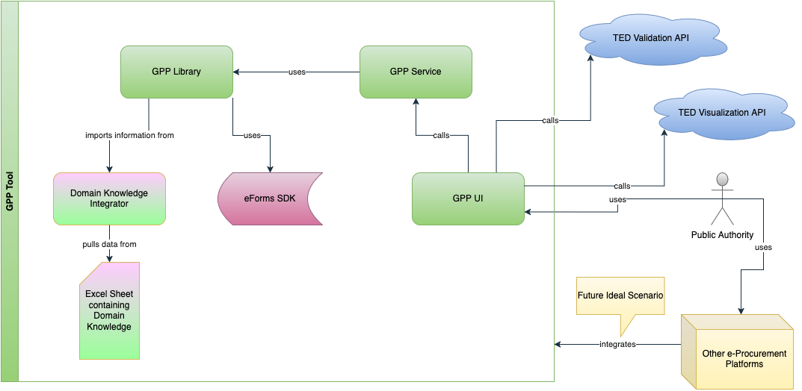

# eForms GPP Service

A Spring Boot REST API service for Green Public Procurement (GPP) analysis of eForms notices.
It acts as an intermediary layer designed to expose the core functionalities of the [GPP Library](https://github.com/uritrejo/eforms-gpp-library) to external applications via a REST API.
This service provides endpoints for analyzing eForm notices, suggesting GPP criteria, and applying them into the eForm notice.
It integrates with the [TED API](https://docs.ted.europa.eu/api/latest/index.html) for validation and visualization.

For an example on using this service, please refer to the [GPP UI](https://github.com/uritrejo/eforms-gpp-ui).

## High-level architecture diagram



## 🚀 Quick Start

### Prerequisites

-   Java 21 or higher
-   Maven 3.6+
-   TED API key (for validation and visualization features)

### Running the Application

1. **Clone and build the project:**

    ```bash
    git clone https://github.com/uritrejo/eforms-gpp-service.git
    cd eforms-gpp-service
    mvn clean compile
    ```

2. **Configure TED API key (optional):**

    ```bash
    # Copy example configuration
    cp src/main/resources/application-dev.properties.example src/main/resources/application-dev.properties

    # Edit and add your TED API key
    # app.api.ted-api-key=your-ted-api-key-here
    ```

3. **Start the service:**

    ```bash
    mvn spring-boot:run
    ```

4. **Access the API documentation:**
    - **Swagger UI**: http://localhost:4420/swagger-ui.html
    - **OpenAPI JSON**: http://localhost:4420/api-docs

## 📖 API Documentation

The service includes comprehensive OpenAPI/Swagger documentation with interactive testing capabilities.

### Available Endpoints

| Endpoint                   | Method | Description                                             |
| -------------------------- | ------ | ------------------------------------------------------- |
| `/api/v1/analyze-notice`   | POST   | Analyze a procurement notice for GPP criteria           |
| `/api/v1/suggest-patches`  | POST   | Suggest GPP patches based on criteria                   |
| `/api/v1/apply-patches`    | POST   | Apply GPP patches to a notice                           |
| `/api/v1/visualize-notice` | POST   | Convert notice to HTML visualization (requires TED API) |
| `/api/v1/validate-notice`  | POST   | Validate notice using TED API                           |

### Using the API

1. Start the application as described above
2. Open your browser to http://localhost:4420/swagger-ui.html
3. Use the interactive documentation to test endpoints
4. All endpoints accept and return JSON

**Note**: The `visualize-notice` and `validate-notice` endpoints require a valid TED API key.

## ⚙️ Configuration

### Configuration Properties

The application uses Spring Boot's configuration system. Settings can be configured in `application.properties` or overridden using environment-specific files.

#### CORS Configuration

-   `app.cors.allowed-origins`: Allowed origins (default: `*`)
-   `app.cors.allowed-methods`: Allowed HTTP methods (default: `GET,POST,PUT,DELETE,OPTIONS`)
-   `app.cors.allowed-headers`: Allowed headers (default: `*`)

#### API Configuration

-   `app.api.ted-api-key`: TED API key for authentication (Bearer token)

#### OpenAPI Configuration

-   `springdoc.api-docs.path`: Path for OpenAPI JSON (default: `/api-docs`)
-   `springdoc.swagger-ui.path`: Path for Swagger UI (default: `/swagger-ui.html`)

### Environment-Specific Configuration

#### Development

```bash
# Copy example configuration
cp application-dev.properties.example application-dev.properties

# Edit configuration as needed, then run:
java -jar eforms-gpp-service.jar --spring.profiles.active=dev
```

#### Production

```bash
# Copy example configuration
cp application-prod.properties.example application-prod.properties

# Edit configuration as needed, then run:
java -jar eforms-gpp-service.jar --spring.profiles.active=prod
```

### Environment Variables

Override configuration using environment variables:

| Environment Variable       | Property                   | Description          |
| -------------------------- | -------------------------- | -------------------- |
| `APP_API_TED_API_KEY`      | `app.api.ted-api-key`      | TED API key          |
| `APP_CORS_ALLOWED_ORIGINS` | `app.cors.allowed-origins` | CORS allowed origins |
| `APP_CORS_ALLOWED_METHODS` | `app.cors.allowed-methods` | CORS allowed methods |
| `APP_CORS_ALLOWED_HEADERS` | `app.cors.allowed-headers` | CORS allowed headers |

Example:

```bash
export APP_API_TED_API_KEY="your-production-api-key"
export APP_CORS_ALLOWED_ORIGINS="https://yourdomain.com"
java -jar eforms-gpp-service.jar
```

## 🐳 Docker Usage

Run with Docker using environment variables:

```bash
docker run -e APP_API_TED_API_KEY="your-api-key" \
           -e APP_CORS_ALLOWED_ORIGINS="https://yourdomain.com" \
           -p 4420:4420 \
           eforms-gpp-service
```

## 🔧 Development

### Building

```bash
# Clean and compile
mvn clean compile

# Run tests
mvn test

# Package
mvn package
```

### Technologies Used

-   **Spring Boot 3.5.0** - Application framework
-   **Spring Web** - REST API framework
-   **SpringDoc OpenAPI** - API documentation
-   **Lombok** - Boilerplate code reduction
-   **Jackson** - JSON processing
-   **Maven** - Build tool

## 🔒 Security Notes

-   Never commit actual API keys to version control
-   Use environment variables or external secret management for sensitive values in production
-   Consider using more restrictive CORS settings in production environments
-   The TED API key is sent as a Bearer token in HTTP headers

## 📚 Additional Resources

### Spring Boot References

-   [Official Apache Maven documentation](https://maven.apache.org/guides/index.html)
-   [Spring Boot Maven Plugin Reference Guide](https://docs.spring.io/spring-boot/3.5.0/maven-plugin)
-   [Spring Web](https://docs.spring.io/spring-boot/3.5.0/reference/web/servlet.html)
-   [Spring Boot Actuator](https://docs.spring.io/spring-boot/3.5.0/reference/actuator/index.html)

### API Documentation

-   [SpringDoc OpenAPI](https://springdoc.org/)
-   [OpenAPI Specification](https://swagger.io/specification/)

### Guides

-   [Building a RESTful Web Service](https://spring.io/guides/gs/rest-service/)
-   [Building REST services with Spring](https://spring.io/guides/tutorials/rest/)
-   [Building a RESTful Web Service with Spring Boot Actuator](https://spring.io/guides/gs/actuator-service/)

## 🎓 Academic Context

This library was developed as part of research at **Politecnico di Milano** focusing on the digitalization and automation of Green Public Procurement processes. It aims to bridge the gap between environmental policy and practical procurement implementation.

_Making public procurement greener, one notice at a time_ 🌱
